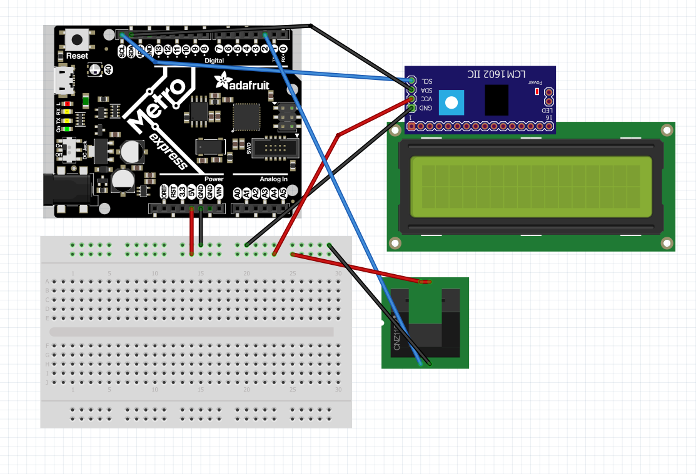
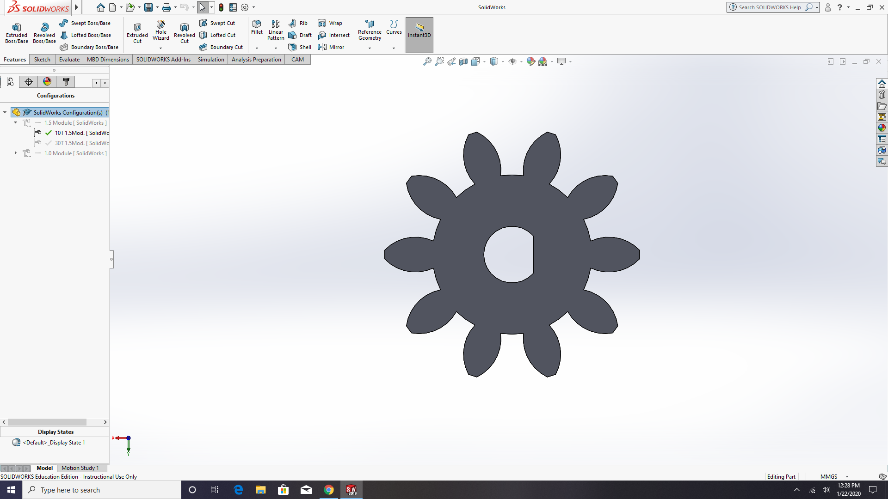
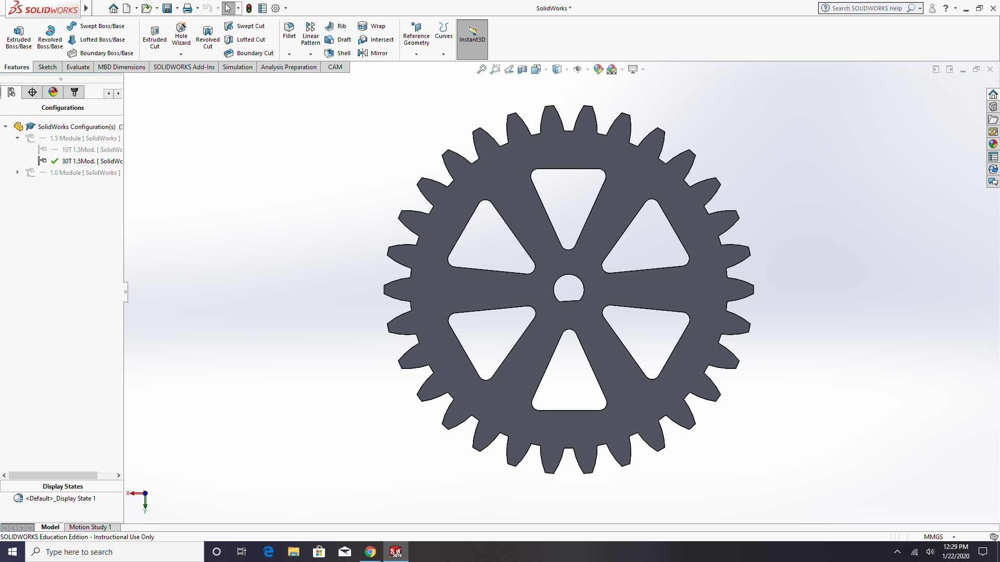
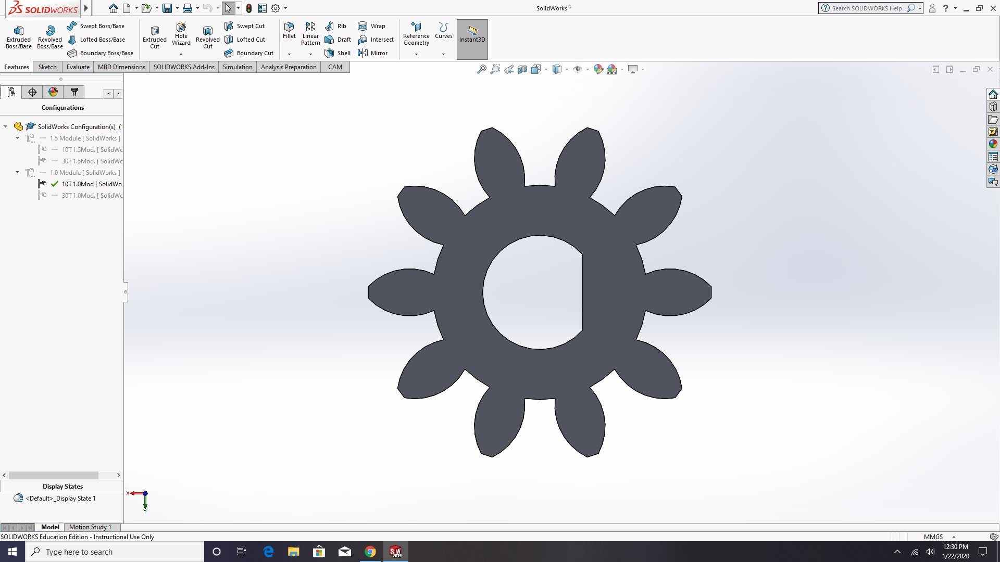
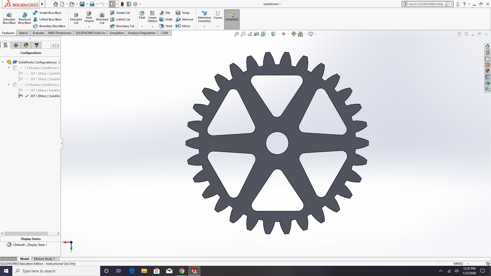

# CircuitPython
My Circuitpython assignments

I have been using the programming language CircuitPython. So far I have used it to make an 
LED Fade in and out, move a servo with capacitive, and have an LCD print which way a switch 
was and how many times a button has been pressed in that position. These files are the code
 I have used to complete these projects. 

## Hello Circuit Python
  ### Objective:
   For this assignment, we where supposed to code an LED on a metro Express board, these are new to us this year, to fade in and out. 
  ### Things I learned: 
  I learned about how these new metro boards work. One I first saw them I thought they where going to be the same as Arduinos. Thiough they do similar things as an Arduino, I learned that they run CircuitPython and have this cool LED already built in to the board.
  
## CircuitPython Servo 
  ### Objective: 
   We where tasked with making a servo move ruight or left, depending on what wire we touched.
  ### Things I Learned: 
   I learned about Capacitive Touch through this assignment. This is a really cool technology that I didn't even know existed before starting this asssignment. Basically, when you touch one of the wires, it sends a signal to the metro and then based on your code it moves the servo whatever direction you have that wire set up to move.
   ### Pictures:
   
  
## Circuit Python LCD
  ### Objective:
  For this assignment, we where tasked with making a LCD count up or down based on the position of a switch. Everytime a button was pressed, the LCD would count up or down 1 based on the switches location.
  ### Things I Learned:
  I ran into some problems with when I would hold the button down and it would count more then 1. I learned to code it aso it would only count one time no matter how long it was pressed for. I also learned all about how buttons and switches can be used together to make a pretty cool device.
  ### Pictures:
   
  
## CircuitPython Photouinterrupters
  ### Objective: 
  For this assignment, I wired a Photointerrupter to print how many times it has been interrupted on an LCD screen.
  
  ### Things I Learned: 
  I got stuck on thecv fact that I could not use time.sleep in the code. It took me a couple of days to figure out how to get the photointerrupter to update to the LCD only when interrupter. After some trial and error, I figured out to use fread = true and lread = true statements. 
  ### Picture:
  
  
## CircuitPython Distance Sensor
  ### Objective:
  
  ### Things I Learned:
  
  ### Picture:
  
## Hello VS Code
  ### Objective: 
  Figure out how to use VS Code to run CircuitPython
  
  ### Things I Learned:
  I learned how to use this new platform rather then using Mu code. I also learned how much easier it is with VS to commit and add things to GitHub.
  
## Fancy LED
 ### Objective:
 Have a line of 6 LED's alternate, blink, chase, and sparkle using fancyLED.
 
 ### Things I Learned: 
 
 ### Picture:
 
# SolidWorks
 
## Gears
### Objective: 
Design four gears with different measurments using variables andc equations

### Picture:

### Things I Learned:
  

