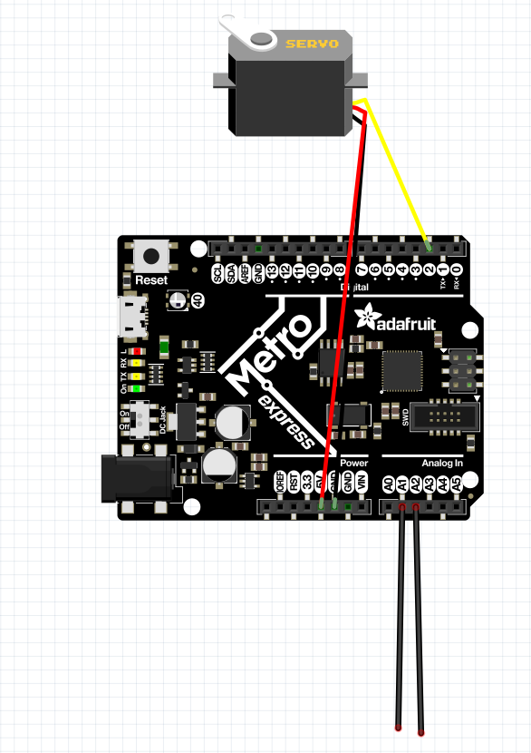
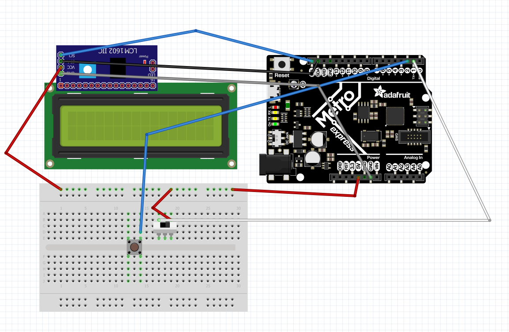

# CircuitPython
My Circuitpython assignments

## Hello Circuit Python
  ### Objective:
   For this assignment, we where supposed to code an LED on a metro Express board, these are new to us this year, to fade in and out. 
  ### Things I learned: 
  I learned about how these new metro boards work. One I first saw them I thought they where going to be the same as Arduinos. Thiough they do similar things as an Arduino, I learned that they run CircuitPython and have this cool LED already built in to the board.
  
## CircuitPython Servo 
  ### Objective: 
   We where tasked with making a servo move ruight or left, depending on what wire we touched.
  ### Things I Learned: 
   I learned about Capacitive Touch through this assignment. This is a really cool technology that I didn't even know existed before starting this asssignment. Basically, when you touch one of the wires, it sends a signal to the metro and then based on your code it moves the servo whatever direction you have that wire set up to move.
   ### Pictures:
   
  
## Circuit Python LCD
  ### Objective:
  For this assignment, we where tasked with making a LCD count up or down based on the position of a switch. Everytime a button was pressed, the LCD would count up or down 1 based on the switches location.
  ### Things I Learned:
  I ran into some problems with when I would hold the button down and it would count more then 1. I learned to code it aso it would only count one time no matter how long it was pressed for. I also learned all about how buttons and switches can be used together to make a pretty cool device.
  ### Pictures:
   
  
## CircuitPython Photouinterrupters
  ### Objective:
  
  ### Things I Learned:
  
## CircuitPython Distance Sensor
  ### Objective:
  
  ### Things I Learned:
  
